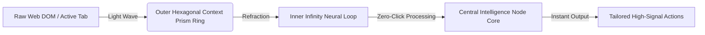

# PROMPTLESS AI — BRAND IDENTITY & LOGO DESIGN SYSTEM ⚡️

> **Version:** 2.0.0 (Apple / Arc / Linear / Raycast / Perplexity Aesthetic)  
> **Core Concept:** Zero-Click Contextual Browser Intelligence without Prompt Textboxes.

---

## 1. Brand Concept: The "Context Prism & Neural Spark"

We explicitly rejected generic lettermarks (e.g., plain "P" or "PA" initials) in favor of a timeless, geometric brand symbol: **The Context Prism & Neural Spark**.



### 💎 Symbolic Meaning:
* **The Hexagonal Prism:** Represents the browser window and structural DOM context. Like a prism that captures raw light, Promptless AI captures your active tab's context.
* **The Infinity Neural Spark (`∞`):** Overlapping continuous flow loops represent zero-click automation, high-frequency understanding, and seamless workflow continuity.
* **The Central Core Node:** Represents instant execution—delivering verified ATS bullets, viral posts, and study summaries without asking the user to type a single prompt.

---

## 2. Complete Iconography & Multi-Resolution Scaling

The brand mark is architected as an SVG vector (`PromptlessLogo.tsx` and `/public/icon.svg`) designed to render crisply from toolbar micro-icons to retina marketing assets.

### 📐 Standard Icon Resolutions
| Size | Primary Use Case | Stroke Weight | Outer Padding |
| :---: | :--- | :---: | :---: |
| **16x16** | Chrome Browser Toolbar / Favicon | `8px` (Simplified) | `0px` |
| **32x32** | Extension Header / Small Badges | `7px` | `1px` |
| **48x48** | Chrome Extension Manager UI | `6.5px` | `2px` |
| **64x64** | macOS Desktop Dock / Side Panel Header | `6px` | `4px` |
| **128x128** | Chrome Web Store Extension Card | `6px` | `8px` |
| **256x256** | Web App Dashboard / Retina Avatar | `6px` | `12px` |
| **512x512** | App Store Asset / Social OG Preview | `6px` | `24px` |
| **1024x1024** | Master Production Vector (`icon.svg`) | `6px` | `48px` |

### 🎨 Color & Theme Variants
1. **Core Brand Gradient:** Linear gradient from Cyan (`#06B6D4`) → Violet (`#8B5CF6`) → Fuchsia (`#EC4899`) on a `#09090B` glassmorphic shield.
2. **Dark Mode Variant:** High-contrast pure white (`#FFFFFF`) with silver glow (`#A1A1AA`) for sleek dark dashboards.
3. **Light Mode Variant:** Obsidian (`#09090B`) with graphite stroke (`#3F3F46`) for light-themed documents.
4. **Monochrome Version:** Responsive `currentColor` binding for UI buttons and inline typography.
5. **Accent Variant:** Sky Blue (`#38BDF8`) to Indigo (`#818CF8`) for notifications and secondary badges.

---

## 3. Comprehensive Color Palette (Tokens)

Our palette avoids plain red, blue, or green in favor of a curated, harmonious HSL/HEX token system tailored for dark-mode glassmorphism.

| Role | Color Name | HEX Token | RGB Token | Tailwind Class |
| :--- | :--- | :---: | :---: | :--- |
| **Primary (Cyan)** | Cyan Prism 500 | `#06B6D4` | `6, 182, 212` | `text-cyan-500` / `from-cyan-500` |
| **Secondary (Violet)** | Violet Intelligence 500 | `#8B5CF6` | `139, 92, 246` | `text-purple-500` / `via-purple-500` |
| **Accent (Fuchsia)** | Fuchsia Spark 500 | `#EC4899` | `236, 72, 153` | `text-pink-500` / `to-pink-500` |
| **Success** | Emerald Flow 500 | `#10B981` | `16, 185, 129` | `text-emerald-500` / `bg-emerald-500` |
| **Warning** | Amber Alert 500 | `#F59E0B` | `245, 158, 11` | `text-amber-500` / `border-amber-500` |
| **Error** | Ruby Guard 500 | `#EF4444` | `239, 68, 68` | `text-red-500` / `bg-red-500` |
| **Surface Dark** | Obsidian 950 | `#09090B` | `9, 9, 11` | `bg-[#09090b]` |
| **Surface Card** | Glass Zinc 900/40 | `#18181B` | `24, 24, 27` | `bg-white/[0.03]` |
| **Text Primary** | Snow Zinc 100 | `#F4F4F5` | `244, 244, 245` | `text-[#f4f4f5]` |
| **Text Secondary** | Muted Zinc 400 | `#A1A1AA` | `161, 161, 170` | `text-zinc-400` |

---

## 4. Typography System

We pair modern geometric sans-serif headings with high-legibility body type and monospace developer tokens.

* **Primary Heading Typeface:** **`Inter`** or **`Outfit`** (Google Fonts, Weights: `600`, `700`, `800`).
  * *Letter Spacing:* `-0.025em` (Tight, Apple-grade tracking).
* **Body Typeface:** **`Inter`** (Weights: `400`, `500`).
  * *Letter Spacing:* `-0.011em` for optimal readability in dense AI markdown cards.
* **Code & Tokens Typeface:** **`JetBrains Mono`** or **`Fira Code`** (Weight: `500`).
  * *Usage:* Used in LIVE SYNC badges, confidence scores, and developer diagnostics.

---

## 5. Spacing, Grid & Glassmorphic Surface System

All components snap to a strict **4px Baseline Grid** with layered depth and subtle soft glows:

```css
/* Core Arc / Linear Glassmorphic Surface Token */
.promptless-card {
  background: rgba(255, 255, 255, 0.03);
  border: 1px solid rgba(255, 255, 255, 0.06);
  backdrop-filter: blur(20px);
  border-radius: 16px;
  box-shadow: 0 8px 32px 0 rgba(0, 0, 0, 0.36);
}
```

---

## 6. Motion & Animation Curves (60 FPS Framer Motion)

The logo is engineered to feel alive without distracting the user from their core task.

### 🚀 Launch / Entrance Animation (`App.tsx` Header):
* **Outer Prism Ring:** Scale `0.85 → 1.0`, opacity `0 → 1`, cubic-bezier easing `(0.16, 1, 0.3, 1)`.
* **Inner Neural Spark:** Path length animation from `0 → 1.0` over `650ms`.

### 🧠 Active "Thinking / Analyzing" Animation (`animated={true}`):
* **Outer Hexagonal Ring:** Continuous smooth linear rotation (`360°` every `18 seconds`).
* **Inner Infinity Loop:** Gentle breathing stroke oscillation (`opacity: [0.75, 1, 0.75]`, `pathLength: [0.7, 1, 0.7]`) over `2.5 seconds`.
* **Central Core Node:** Pulsing scale change (`scale: [1, 1.25, 1]`) matching natural breathing rhythm.

---

## 7. Component Usage Example (`React + TypeScript`)

```tsx
import { PromptlessLogo } from "./components/PromptlessLogo";

// 1. In Extension Header (32x32 Gradient)
<PromptlessLogo size={32} variant="gradient" />

// 2. In "Analyzing Current Page" Loading State (56x56 Animated)
<PromptlessLogo size={56} variant="gradient" animated={true} />

// 3. In Monochrome Action Button (16x16)
<PromptlessLogo size={16} variant="monochrome" className="text-zinc-400" />
```
