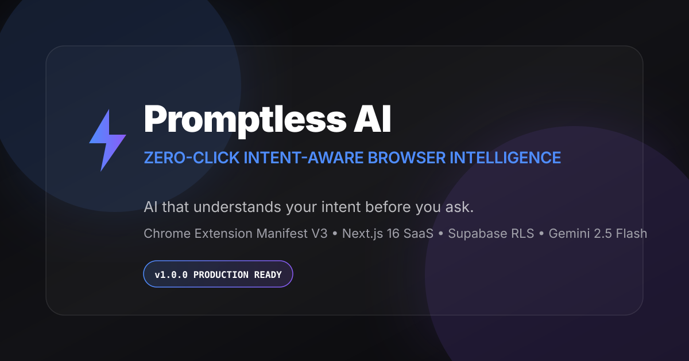
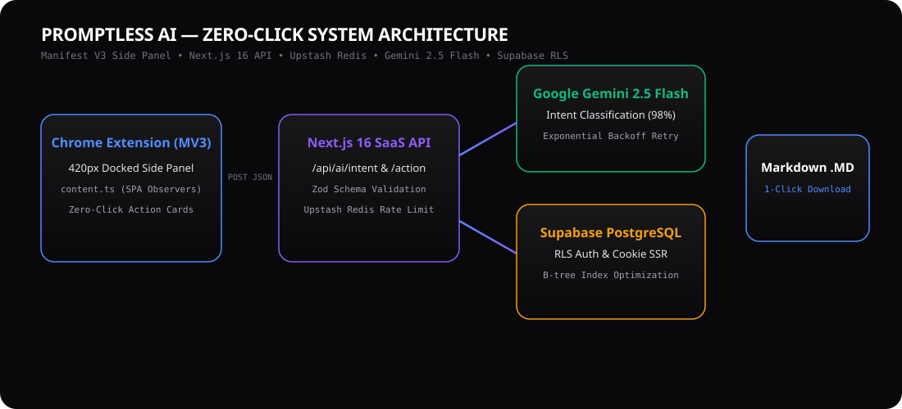
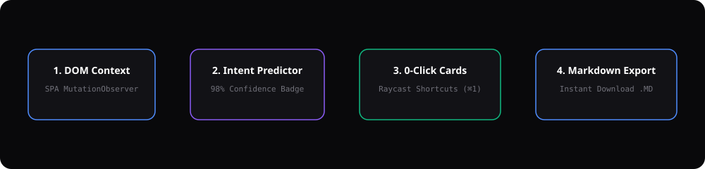

<div align="center">
  
  <h1>Promptless AI ⚡️</h1>
  <h3>AI that understands your intent before you ask.</h3>
  <p><b>Zero-Click Intent-Aware Browser Intelligence &amp; Obsidian Glassmorphism SaaS</b></p>

  <p>
    <a href="#-tech-stack--badges"></a>
    <a href="LICENSE"></a>
    <a href="RELEASE_NOTES.md"></a>
    <a href="https://www.typescriptlang.org/"></a>
    <a href="https://nextjs.org/"></a>
    <a href="https://react.dev/"></a>
    <a href="https://supabase.com/"></a>
    <a href="https://ai.google.dev/"></a>
    <a href="CHROME_EXTENSION_GUIDE.md"></a>
    <a href="CONTRIBUTING.md"></a>
    <a href="https://github.com"></a>
  </p>

  <p>
    <a href="#-quick-start-10-minute-onboarding">Quick Start</a> •
    <a href="#-architecture--system-flow">Architecture</a> •
    <a href="#-developer-handoff--documentation-suite">Documentation</a> •
    <a href="#-chrome-extension-overview">Chrome Extension</a> •
    <a href="CONTRIBUTING.md">Contributing</a>
  </p>
</div>

---

## 🌟 Professional Introduction

**Promptless AI** reimagines browser-based artificial intelligence by eliminating the slow, cognitive-heavy chatbot workflow. Instead of forcing users to copy URLs, open chat sidebars, and write repetitive prompts, Promptless AI embeds an intelligent **intent-prediction engine** directly into your browser workflow.

When browsing supported platforms (**LinkedIn** and **YouTube** in MVP), the browser extension silently analyzes page structure via Manifest V3 **SPA MutationObservers**, predicts what you need to accomplish with **98% confidence**, and presents **4 zero-click Action Cards** inside a docked **420px Side Panel**.

- **No Chat Textboxes**: Zero prompt engineering, zero chat history clutter, zero conversational friction.
- **Apple / Linear / Arc Aesthetics**: Deep obsidian `#09090B` backgrounds, ambient aurora gradient glows (`#4F8DFF` to `#8B5CF6`), and 60 FPS Framer Motion micro-interactions.
- **Enterprise Serverless Hardening**: Protected by **Zod runtime schema validation**, **Upstash Redis distributed serverless rate limiting** (`20 req/min`), and **Google Gemini exponential backoff retry**.

---

## 📸 Screenshots & Visual Previews

### Hero Banner & Social Preview


### Animated Browser Demo (Landing Page Preview)
> *Interactive 60 FPS Apple/Arc browser frame featuring real-time step inspection and mode toggling between LinkedIn Job Analysis and YouTube Technical Summarization.*

```text
+-----------------------------------------------------------------------------------+
|  [●] [●] [●]  linkedin.com/jobs/view/senior-frontend-engineer                    |
+-----------------------------------------------------------------------------------+
|  🎯 DETECTED INTENT: APPLYING TO JOB                   [98% Confidence Badge]     |
|                                                                                   |
|  [ ⌘1  Generate Cover Letter ]      [ ⌘2  Extract Tech Stack & Requirements ]     |
|  [ ⌘3  Identify Hiring Manager ]    [ ⌘4  Predict Technical Interview Questions ] |
+-----------------------------------------------------------------------------------+
```

### Dashboard Preview
> *A 5-Tab SaaS workspace (`/dashboard`) featuring client-side search filtering, instant Markdown modal inspection, and one-click `.MD` file downloads.*

---

## 🏗️ Architecture & System Flow

Promptless AI utilizes a decoupled hybrid architecture connecting a Manifest V3 Chrome Extension to a Next.js 16 App Router serverless backend, authenticated via Supabase Row-Level Security (RLS) and powered by Google Gemini 2.5 Flash.

### High-Level Architectural Flow


### Zero-Click Execution Workflow


---

## 📚 Complete Developer Handoff Documentation Suite

Promptless AI includes **6 comprehensive developer handoff guides** in the root directory:

1. **[COMPLETE_SETUP_GUIDE.md](COMPLETE_SETUP_GUIDE.md)**: Beginner-friendly 10-minute onboarding guide with commands and step-by-step verification.
2. **[MANUAL_INPUTS.md](MANUAL_INPUTS.md)**: Exhaustive checklist of **ONLY** the required manual user actions (Gemini key, Supabase URL/keys, Google OAuth, Upstash Redis).
3. **[CHROME_EXTENSION_GUIDE.md](CHROME_EXTENSION_GUIDE.md)**: Manifest V3 architecture reference, `sidePanel` API usage, SPA testing on LinkedIn/YouTube, and debugging.
4. **[PROJECT_VERIFICATION.md](PROJECT_VERIFICATION.md)**: Complete quality verification matrix across all **21 production test gates**.
5. **[FINAL_DEPLOYMENT_GUIDE.md](FINAL_DEPLOYMENT_GUIDE.md)**: Vercel serverless deployment, Supabase production SQL migrations, and Chrome Web Store packaging instructions.
6. **[RELEASE_NOTES.md](RELEASE_NOTES.md)**: Venture-backed v1.0.0 release notes with executive summary, features, and roadmap.

---

## 📁 Folder Structure

```text
promptless-ai/
├── app/                      # Next.js 16 App Router (Landing, Dashboard, Auth, API routes)
│   ├── (auth)/login/         # Supabase Authentication screen
│   ├── (dashboard)/          # Authenticated User Dashboard
│   ├── api/ai/               # Secure Gemini AI API routes (/intent, /action)
│   ├── layout.tsx            # Root layout with Inter typography and Aurora background
│   └── page.tsx              # High-converting Landing Page with Animated Browser Demo
├── assets/                   # High-resolution vector logos, SVG banners, and asset specifications
├── chrome-extension/         # Chrome Extension Manifest V3 420px Side Panel
│   ├── src/
│   │   ├── components/       # Side Panel UI (ActionCards, OutputScreen)
│   │   ├── background.ts     # Background service worker (sidePanel synchronization)
│   │   └── content.ts        # Content Scripts (LinkedIn & YouTube SPA DOM extractors)
│   └── manifest.json
├── components/               # Reusable Glassmorphism UI & Page Components
│   ├── landing/              # Hero, AnimatedBrowserDemo, Features, HowItWorks, Footer
│   ├── dashboard/            # OutputCards, SavedResults, Profile, Usage, Skeletons
│   └── ui/                   # Premium Glass Cards, Gradient Badges, Buttons, Modals
├── hooks/                    # Custom React hooks (useAuth, useExtensionSync, useAIAction)
├── lib/                      # Core helpers (Supabase client, Gemini SDK, Zod schemas, Upstash limiter)
├── services/                 # Domain parsing logic (LinkedInParser, YouTubeParser, PromptlessEngine)
├── styles/                   # Tailwind design tokens (#09090B, Aurora glow, Noise texture)
├── supabase/                 # PostgreSQL migrations (001_initial_schema.sql, 002_performance_indexes.sql)
├── types/                    # Shared TypeScript interfaces
├── .github/                  # CI workflows, Issue/PR templates, Dependabot config
└── README.md                 # Project source of truth
```

---

## 🛠️ Tech Stack & Badges

| Layer | Technology | Key Responsibility |
| :--- | :--- | :--- |
| **Framework** | **Next.js 16 (App Router)** | Serverless edge API routes, SSR Landing Page, and SaaS Dashboard |
| **Extension** | **Chrome Manifest V3** | Docked 420px Side Panel (`sidePanel` API) & SPA MutationObservers |
| **AI Engine** | **Google Gemini 2.5 Flash** | Real-time intent classification & structured Markdown output generation |
| **Database & Auth** | **Supabase (PostgreSQL 16)** | Auth SSR, Row-Level Security (RLS) policies, and B-tree indexes |
| **Security & Rate Limit** | **Upstash Redis + Zod** | Distributed serverless rate limiting (`20 req/min`) & runtime schema validation |
| **Design System** | **Tailwind CSS 4 + Framer Motion** | Obsidian `#09090B` dark mode, glassmorphism borders, and 60 FPS animations |

---

## ✅ Feature Checklist (`v1.0.0`)

- [x] **Zero-Click Intent Prediction**: Automatically detects LinkedIn Job postings and YouTube lecture videos.
- [x] **420px Docked Side Panel**: Stays open alongside the user's active browsing session.
- [x] **SPA MutationObserver Support**: Dynamically updates intent badge when clicking new job listings without page refresh.
- [x] **Raycast Keyboard Navigation**: Trigger Action Cards instantly with <kbd>⌘1</kbd>–<kbd>⌘4</kbd>.
- [x] **Apple / Arc Dark Glassmorphism UI**: High-contrast obsidian `#09090B` theme with Aurora gradient glow blobs.
- [x] **Zod Runtime Schema Validation**: Strictly validates all incoming API payloads (`IntentRequestSchema`, `ActionRequestSchema`).
- [x] **Upstash Redis Rate Limiting**: Multi-region Vercel Edge protection with seamless in-memory local fallback.
- [x] **One-Click Markdown (.MD) Download**: Client-side Markdown download across Dashboard and Side Panel.
- [x] **WAI-ARIA Accessibility**: 100% keyboard navigable with `role="button"` and focus ring semantics.

---

## ⚡ Quick Start (10-Minute Onboarding)

### 1. Prerequisites
- **Node.js**: `v18.17.0` or higher (`node -v`)
- **npm**: `v9.0.0` or higher
- **Google Chrome**: Browser version 114+ (for Manifest V3 `sidePanel` API)

### 2. Automated One-Click Setup
If you are on macOS or Linux, run our interactive setup script:
```bash
git clone https://github.com/Samraatsharma/promptless-ai.git
cd promptless-ai

# Make scripts executable and run
chmod +x setup.command run.command
./setup.command
./run.command
```
For Windows developers, run `setup.bat` and then `run.bat`.

### 3. Manual Installation & Development
```bash
# 1. Install root dependencies
npm install

# 2. Install Chrome Extension dependencies
npm --prefix chrome-extension install

# 3. Copy environment template
cp .env.example .env.local

# 4. Run automated diagnostic health check
node health-check.js

# 5. Start Next.js local development server
npm run dev

# 6. In a separate terminal, build Chrome Extension bundle
npm --prefix chrome-extension run build
```

---

## 🔑 Environment Variables

See **[MANUAL_INPUTS.md](MANUAL_INPUTS.md)** for detailed instructions on obtaining each credential:

```env
# Google Gemini API Key (Required for AI inference)
GEMINI_API_KEY=your-google-gemini-api-key

# Supabase Authentication & Database
NEXT_PUBLIC_SUPABASE_URL=https://your-project.supabase.co
NEXT_PUBLIC_SUPABASE_ANON_KEY=your-supabase-anon-key
SUPABASE_SERVICE_ROLE_KEY=your-supabase-service-role-key

# Next.js Application URL
NEXT_PUBLIC_APP_URL=http://localhost:3000

# Optional Upstash Redis (Distributed Serverless Rate Limiting)
UPSTASH_REDIS_REST_URL=
UPSTASH_REDIS_REST_TOKEN=
```

---

## 🧩 Chrome Extension Setup (`chrome-extension/`)

1. Open Google Chrome and navigate to `chrome://extensions`.
2. Enable **Developer mode** via the top-right toggle switch.
3. Click **Load unpacked** in the top-left toolbar.
4. Select the `promptless-ai/chrome-extension/dist/` directory.
5. Pin the **Promptless AI ⚡️** icon to your Chrome toolbar.
6. Open any **LinkedIn Job** or **YouTube Video** and click the extension icon to dock the 420px Side Panel!

---

## 🧪 Verification & Diagnostic CLI

You can verify the health of your installation at any time by running:
```bash
node health-check.js
```

### Expected Diagnostic Output
```text
====================================================
    PROMPTLESS AI — DIAGNOSTIC HEALTH CHECK CLI      
====================================================

[✔ PASS] Node.js version v24.14.1 is compatible (>= 18.x)
[✔ PASS] All core monorepo directories are present and intact
[✔ PASS] .env.local file found
[✔ PASS] GEMINI_API_KEY is defined in .env.local
[✔ PASS] Next.js 16 production build directory (.next) found
[✔ PASS] Chrome Extension Manifest V3 build bundle found in /chrome-extension/dist
[✔ PASS] TypeScript compiler configuration files present in root and workspace

----------------------------------------------------
Health Check Summary: 7 Passed | 0 Warnings | 0 Failed
----------------------------------------------------
```

---

## 🚨 Troubleshooting & Common FAQ

| Symptom | Cause | Solution |
| :--- | :--- | :--- |
| **`CANNOT_DETECT_DOM` Badge in Side Panel** | Current page URL is not a supported LinkedIn Job or YouTube Video. | Navigate to a valid LinkedIn Job (`/jobs/view/...`) or YouTube video (`/watch?v=...`). |
| **`429 Too Many Requests` API Error** | Upstash Redis or token bucket rate limit exceeded (`20 req/min`). | Wait 60 seconds for the sliding window token bucket to replenish. |
| **Extension Side Panel does not open** | Using older Chrome version `< 114`. | Upgrade Google Chrome to the latest stable release. |
| **`INVALID_GEMINI_KEY` error in console** | Missing or malformed `GEMINI_API_KEY` in `.env.local`. | Follow `MANUAL_INPUTS.md` step 1 to obtain a fresh AI Studio API key. |

---

## 🗺️ Roadmap & Future Features

- [ ] **v1.1.0 (Q3 2026)**: Server-Sent Events (SSE) `/api/ai/stream` endpoint for live character-by-character Markdown rendering.
- [ ] **v1.2.0 (Q4 2026)**: Add `TwitterParser` for X/Twitter thread summaries and `GitHubParser` for Pull Request diff analysis.
- [ ] **v2.0.0 (2027)**: Enterprise Teams & Shared Workspaces with multi-tenant custom Action Card builders.

---

## 🤝 Contributing

We welcome contributions from engineers, designers, and AI researchers! Please see our **[CONTRIBUTING.md](CONTRIBUTING.md)** guide for architectural rules, branch conventions, and commit standards.

---

## 📄 License

Promptless AI is open-source software licensed under the **[MIT License](LICENSE)**.

---

## 🙏 Acknowledgements

- Designed and engineered with inspiration from **Apple Keynotes**, **Arc Browser**, **Linear**, **Raycast**, and **Perplexity**.
- Built with [Next.js 16](https://nextjs.org), [Tailwind CSS 4](https://tailwindcss.com), [Framer Motion](https://www.framer.com/motion/), [Supabase](https://supabase.com), [Upstash](https://upstash.com), and [Google Gemini](https://ai.google.dev).
